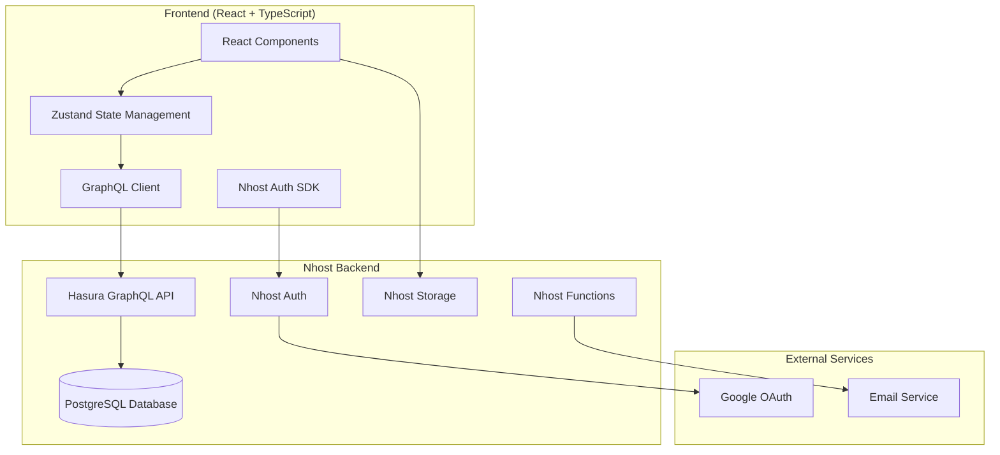

# Design Document

## Overview

Este documento descreve o design técnico para um sistema de gestão clínica moderno usando Nhost como backend-as-a-service. O sistema será construído com React/TypeScript no frontend e aproveitará os serviços gerenciados do Nhost (PostgreSQL, GraphQL, Auth, Storage) para criar uma solução limpa, escalável e de fácil manutenção.

**Importante:** O novo sistema deve preservar o design visual, layout e experiência do usuário (UX) do sistema atual, aproveitando apenas a lógica de negócio e funcionalidades, mas com uma implementação técnica completamente nova e simplificada.

**SaaS Multi-Tenant:** O sistema é uma solução SaaS com arquitetura multi-tenant, onde cada clínica representa um tenant isolado. Inclui sistema de planos de assinatura com feature flags configuráveis pelo super admin para personalizar funcionalidades por plano.

## Architecture

### High-Level Architecture



### Technology Stack

**Frontend:**
- React 18 with TypeScript
- Vite for build tooling
- TailwindCSS for styling (preservando classes e design atual)
- Zustand for state management (substituindo estado atual)
- React Query for data fetching (substituindo fetch atual)
- React Hook Form for form handling
- React Router for navigation (mantendo rotas atuais)
- Recharts for data visualization (preservando gráficos atuais)
- Lucide React for icons (mantendo ícones atuais)

**Backend (Nhost):**
- PostgreSQL database
- Hasura GraphQL API
- Nhost Auth with Google OAuth
- Nhost Storage for file uploads
- Nhost Functions for custom logic

**Development:**
- ESLint + Prettier for code quality
- TypeScript for type safety
- GraphQL Code Generator for type generation

## Components and Interfaces

### Database Schema

```sql
-- SaaS Multi-Tenant Core Tables with RLS (Row Level Security)

-- Subscription Plans (managed by super admin)
CREATE TABLE subscription_plans (
  id UUID PRIMARY KEY DEFAULT gen_random_uuid(),
  name TEXT NOT NULL,
  description TEXT,
  price_monthly DECIMAL(10,2) NOT NULL,
  price_yearly DECIMAL(10,2),
  max_users INTEGER,
  max_patients INTEGER,
  max_appointments_per_month INTEGER,
  features JSONB NOT NULL DEFAULT '{}', -- Feature flags as JSON
  is_active BOOLEAN DEFAULT true,
  is_popular BOOLEAN DEFAULT false,
  sort_order INTEGER DEFAULT 0,
  created_at TIMESTAMPTZ DEFAULT NOW(),
  updated_at TIMESTAMPTZ DEFAULT NOW()
);

-- Feature Flags (configurable by super admin)
CREATE TABLE feature_flags (
  id UUID PRIMARY KEY DEFAULT gen_random_uuid(),
  key TEXT UNIQUE NOT NULL, -- e.g., 'whatsapp_integration', 'ai_agent', 'advanced_reports'
  name TEXT NOT NULL,
  description TEXT,
  category TEXT, -- e.g., 'communication', 'analytics', 'automation'
  is_premium BOOLEAN DEFAULT false,
  created_at TIMESTAMPTZ DEFAULT NOW(),
  updated_at TIMESTAMPTZ DEFAULT NOW()
);

-- Plan Features (many-to-many relationship)
CREATE TABLE plan_features (
  id UUID PRIMARY KEY DEFAULT gen_random_uuid(),
  plan_id UUID REFERENCES subscription_plans(id) ON DELETE CASCADE,
  feature_flag_id UUID REFERENCES feature_flags(id) ON DELETE CASCADE,
  is_enabled BOOLEAN DEFAULT true,
  limits JSONB, -- Feature-specific limits (e.g., max_whatsapp_messages: 1000)
  created_at TIMESTAMPTZ DEFAULT NOW(),
  UNIQUE(plan_id, feature_flag_id)
);

-- Tenants (Clinics)
CREATE TABLE tenants (
  id UUID PRIMARY KEY DEFAULT gen_random_uuid(),
  name TEXT NOT NULL,
  subdomain TEXT UNIQUE,
  logo_url TEXT,
  primary_color TEXT DEFAULT '#3B82F6',
  secondary_color TEXT DEFAULT '#10B981',
  is_active BOOLEAN DEFAULT true,
  plan_id UUID REFERENCES subscription_plans(id),
  subscription_status TEXT DEFAULT 'trial' CHECK (subscription_status IN ('trial', 'active', 'past_due', 'cancelled', 'suspended')),
  trial_ends_at TIMESTAMPTZ,
  subscription_starts_at TIMESTAMPTZ,
  subscription_ends_at TIMESTAMPTZ,
  billing_email TEXT,
  billing_address JSONB,
  created_at TIMESTAMPTZ DEFAULT NOW(),
  updated_at TIMESTAMPTZ DEFAULT NOW()
);

-- Tenant Feature Overrides (for custom plans or temporary access)
CREATE TABLE tenant_feature_overrides (
  id UUID PRIMARY KEY DEFAULT gen_random_uuid(),
  tenant_id UUID REFERENCES tenants(id) ON DELETE CASCADE,
  feature_flag_id UUID REFERENCES feature_flags(id) ON DELETE CASCADE,
  is_enabled BOOLEAN NOT NULL,
  limits JSONB,
  expires_at TIMESTAMPTZ,
  reason TEXT, -- e.g., 'promotional_access', 'custom_plan', 'beta_testing'
  created_by UUID, -- super admin who granted access
  created_at TIMESTAMPTZ DEFAULT NOW(),
  UNIQUE(tenant_id, feature_flag_id)
);

-- Usage Tracking (for billing and limits)
CREATE TABLE tenant_usage (
  id UUID PRIMARY KEY DEFAULT gen_random_uuid(),
  tenant_id UUID REFERENCES tenants(id) ON DELETE CASCADE,
  feature_key TEXT NOT NULL,
  usage_count INTEGER DEFAULT 0,
  period_start TIMESTAMPTZ NOT NULL,
  period_end TIMESTAMPTZ NOT NULL,
  metadata JSONB,
  created_at TIMESTAMPTZ DEFAULT NOW(),
  updated_at TIMESTAMPTZ DEFAULT NOW(),
  UNIQUE(tenant_id, feature_key, period_start)
);

-- Billing History
CREATE TABLE billing_history (
  id UUID PRIMARY KEY DEFAULT gen_random_uuid(),
  tenant_id UUID REFERENCES tenants(id) ON DELETE CASCADE,
  plan_id UUID REFERENCES subscription_plans(id),
  amount DECIMAL(10,2) NOT NULL,
  currency TEXT DEFAULT 'BRL',
  billing_period_start TIMESTAMPTZ NOT NULL,
  billing_period_end TIMESTAMPTZ NOT NULL,
  status TEXT DEFAULT 'pending' CHECK (status IN ('pending', 'paid', 'failed', 'refunded')),
  payment_method TEXT,
  external_payment_id TEXT, -- Stripe/payment provider ID
  invoice_url TEXT,
  created_at TIMESTAMPTZ DEFAULT NOW(),
  updated_at TIMESTAMPTZ DEFAULT NOW()
);

CREATE TABLE users (
  id UUID PRIMARY KEY DEFAULT gen_random_uuid(),
  tenant_id UUID REFERENCES tenants(id) ON DELETE CASCADE,
  email TEXT NOT NULL,
  display_name TEXT,
  role TEXT DEFAULT 'user' CHECK (role IN ('super_admin', 'owner', 'admin', 'professional', 'receptionist')),
  is_active BOOLEAN DEFAULT true,
  is_super_admin BOOLEAN DEFAULT false, -- Global super admin access
  last_login_at TIMESTAMPTZ,
  created_at TIMESTAMPTZ DEFAULT NOW(),
  updated_at TIMESTAMPTZ DEFAULT NOW()
);

CREATE TABLE patients (
  id UUID PRIMARY KEY DEFAULT gen_random_uuid(),
  tenant_id UUID REFERENCES tenants(id) ON DELETE CASCADE,
  name TEXT NOT NULL,
  phone TEXT,
  email TEXT,
  cpf TEXT,
  birth_date DATE,
  address TEXT,
  emergency_contact TEXT,
  medical_history TEXT,
  is_active BOOLEAN DEFAULT true,
  created_at TIMESTAMPTZ DEFAULT NOW(),
  updated_at TIMESTAMPTZ DEFAULT NOW()
);

CREATE TABLE professionals (
  id UUID PRIMARY KEY DEFAULT gen_random_uuid(),
  tenant_id UUID REFERENCES tenants(id) ON DELETE CASCADE,
  name TEXT NOT NULL,
  registration_number TEXT,
  specialty TEXT,
  phone TEXT,
  email TEXT,
  working_hours JSONB,
  is_active BOOLEAN DEFAULT true,
  created_at TIMESTAMPTZ DEFAULT NOW(),
  updated_at TIMESTAMPTZ DEFAULT NOW()
);

CREATE TABLE appointments (
  id UUID PRIMARY KEY DEFAULT gen_random_uuid(),
  tenant_id UUID REFERENCES tenants(id) ON DELETE CASCADE,
  patient_id UUID REFERENCES patients(id) ON DELETE CASCADE,
  professional_id UUID REFERENCES professionals(id) ON DELETE CASCADE,
  title TEXT NOT NULL,
  description TEXT,
  start_datetime TIMESTAMPTZ NOT NULL,
  end_datetime TIMESTAMPTZ NOT NULL,
  status TEXT DEFAULT 'scheduled' CHECK (status IN ('scheduled', 'confirmed', 'in_progress', 'completed', 'cancelled', 'no_show')),
  service_type TEXT,
  notes TEXT,
  created_by UUID REFERENCES users(id),
  created_at TIMESTAMPTZ DEFAULT NOW(),
  updated_at TIMESTAMPTZ DEFAULT NOW()
);

CREATE TABLE material_categories (
  id UUID PRIMARY KEY DEFAULT gen_random_uuid(),
  tenant_id UUID REFERENCES tenants(id) ON DELETE CASCADE,
  name TEXT NOT NULL,
  description TEXT,
  is_active BOOLEAN DEFAULT true,
  created_at TIMESTAMPTZ DEFAULT NOW(),
  updated_at TIMESTAMPTZ DEFAULT NOW()
);

CREATE TABLE materials (
  id UUID PRIMARY KEY DEFAULT gen_random_uuid(),
  tenant_id UUID REFERENCES tenants(id) ON DELETE CASCADE,
  category_id UUID REFERENCES material_categories(id),
  name TEXT NOT NULL,
  brand TEXT,
  description TEXT,
  unit_type TEXT DEFAULT 'unidade',
  min_stock_level INTEGER DEFAULT 0,
  max_stock_level INTEGER DEFAULT 100,
  current_stock INTEGER DEFAULT 0,
  unit_cost DECIMAL(10,2) DEFAULT 0,
  supplier_name TEXT,
  supplier_contact TEXT,
  is_active BOOLEAN DEFAULT true,
  created_at TIMESTAMPTZ DEFAULT NOW(),
  updated_at TIMESTAMPTZ DEFAULT NOW()
);

CREATE TABLE material_entries (
  id UUID PRIMARY KEY DEFAULT gen_random_uuid(),
  tenant_id UUID REFERENCES tenants(id) ON DELETE CASCADE,
  material_id UUID REFERENCES materials(id) ON DELETE CASCADE,
  entry_type TEXT DEFAULT 'in' CHECK (entry_type IN ('in', 'out')),
  quantity INTEGER NOT NULL,
  unit_cost DECIMAL(10,2) DEFAULT 0,
  total_cost DECIMAL(10,2) DEFAULT 0,
  expiry_date DATE,
  batch_number TEXT,
  supplier_name TEXT,
  invoice_number TEXT,
  notes TEXT,
  created_by UUID REFERENCES users(id),
  created_at TIMESTAMPTZ DEFAULT NOW()
);

CREATE TABLE waiting_list (
  id UUID PRIMARY KEY DEFAULT gen_random_uuid(),
  tenant_id UUID REFERENCES tenants(id) ON DELETE CASCADE,
  patient_id UUID REFERENCES patients(id) ON DELETE CASCADE,
  professional_id UUID REFERENCES professionals(id),
  preferred_date DATE,
  preferred_time_start TIME,
  preferred_time_end TIME,
  priority INTEGER DEFAULT 1 CHECK (priority BETWEEN 1 AND 5),
  status TEXT DEFAULT 'waiting' CHECK (status IN ('waiting', 'contacted', 'scheduled', 'cancelled')),
  notes TEXT,
  created_at TIMESTAMPTZ DEFAULT NOW(),
  updated_at TIMESTAMPTZ DEFAULT NOW()
);

CREATE TABLE anamnesis_templates (
  id UUID PRIMARY KEY DEFAULT gen_random_uuid(),
  tenant_id UUID REFERENCES tenants(id) ON DELETE CASCADE,
  name TEXT NOT NULL,
  description TEXT,
  sections JSONB NOT NULL,
  is_active BOOLEAN DEFAULT true,
  is_default BOOLEAN DEFAULT false,
  created_by UUID REFERENCES users(id),
  created_at TIMESTAMPTZ DEFAULT NOW(),
  updated_at TIMESTAMPTZ DEFAULT NOW()
);

CREATE TABLE anamnesis_forms (
  id UUID PRIMARY KEY DEFAULT gen_random_uuid(),
  tenant_id UUID REFERENCES tenants(id) ON DELETE CASCADE,
  patient_id UUID REFERENCES patients(id) ON DELETE CASCADE,
  appointment_id UUID REFERENCES appointments(id),
  template_id UUID REFERENCES anamnesis_templates(id) ON DELETE CASCADE,
  form_token TEXT UNIQUE NOT NULL,
  form_data JSONB,
  status TEXT DEFAULT 'pending' CHECK (status IN ('pending', 'completed', 'expired')),
  alerts_detected JSONB,
  expires_at TIMESTAMPTZ,
  completed_at TIMESTAMPTZ,
  sent_at TIMESTAMPTZ,
  created_at TIMESTAMPTZ DEFAULT NOW(),
  updated_at TIMESTAMPTZ DEFAULT NOW()
);
```

### Arquitetura Extremamente Componentizada

O sistema seguirá uma arquitetura modular com máxima separação de responsabilidades, onde cada funcionalidade é um módulo independente e reutilizável.

```
src/
├── shared/                           # Shared utilities and components
│   ├── components/                   # Atomic design system components
│   │   ├── atoms/                    # Smallest UI components
│   │   │   ├── Button/
│   │   │   │   ├── Button.tsx
│   │   │   │   ├── Button.test.tsx
│   │   │   │   ├── Button.stories.tsx
│   │   │   │   └── index.ts
│   │   │   ├── Input/
│   │   │   ├── Icon/
│   │   │   ├── Badge/
│   │   │   ├── Avatar/
│   │   │   └── Spinner/
│   │   ├── molecules/                # Combinations of atoms
│   │   │   ├── FormField/
│   │   │   ├── SearchBox/
│   │   │   ├── DatePicker/
│   │   │   ├── Dropdown/
│   │   │   ├── Pagination/
│   │   │   └── StatusIndicator/
│   │   ├── organisms/               # Complex UI components
│   │   │   ├── DataTable/
│   │   │   ├── Modal/
│   │   │   ├── Calendar/
│   │   │   ├── Form/
│   │   │   ├── Chart/
│   │   │   └── FileUpload/
│   │   └── templates/               # Page layout templates
│   │       ├── DashboardLayout/
│   │       ├── FormLayout/
│   │       ├── ListLayout/
│   │       └── DetailLayout/
│   ├── hooks/                       # Reusable custom hooks
│   │   ├── api/                     # API-related hooks
│   │   │   ├── useQuery.ts
│   │   │   ├── us            # CSS/SCSS preservando design atual
│   ├── globals.css           # Estilos globais atuais
│   ├── components.css        # Estilos de componentes
│   └── themes.css            # Temas e cores atuais
└── graphql/                  # GraphQL queries and mutations
```

### Design System Preservation

**Cores e Temas:**
- Manter paleta de cores atual (primária, secundária, neutras)
- Preservar sistema de temas claro/escuro se existente
- Manter identidade visual da marca

**Tipografia:**
- Preservar fontes utilizadas atualmente
- Manter hierarquia tipográfica (h1, h2, body, etc.)
- Conservar tamanhos e pesos de fonte

**Componentes Visuais:**
- Manter aparência de botões, inputs, cards
- Preservar iconografia atual (Lucide React)
- Conservar espaçamentos e grid system
- Manter animações e transições existentes

**Layout e Navegação:**
- Preservar estrutura de sidebar e header
- Manter organização de menus e submenus
- Conservar breadcrumbs e navegação
- Preservar responsividade atual

### State Management Architecture

```typescript
// Using Zustand for simple, type-safe state management
interface AppStore {
  // Auth state
  user: User | null;
  tenant: Tenant | null;
  
  // UI state
  sidebarOpen: boolean;
  theme: 'light' | 'dark';
  
  // Actions
  setUser: (user: User | null) => void;
  setTenant: (tenant: Tenant | null) => void;
  toggleSidebar: () => void;
  setTheme: (theme: 'light' | 'dark') => void;
}

// Feature-specific stores
interface PatientsStore {
  patients: Patient[];
  selectedPatient: Patient | null;
  loading: boolean;
  
  setPatients: (patients: Patient[]) => void;
  selectPatient: (patient: Patient | null) => void;
  setLoading: (loading: boolean) => void;
}
```

## Data Models

### Core Types

```typescript
interface Tenant {
  id: string;
  name: string;
  subdomain?: string;
  logoUrl?: string;
  primaryColor: string;
  secondaryColor: string;
  isActive: boolean;
  planType: string;
  createdAt: string;
  updatedAt: string;
}

interface User {
  id: string;
  tenantId: string;
  email: string;
  displayName?: string;
  role: 'owner' | 'admin' | 'professional' | 'receptionist';
  isActive: boolean;
  createdAt: string;
  updatedAt: string;
}

interface Patient {
  id: string;
  tenantId: string;
  name: string;
  phone?: string;
  email?: string;
  cpf?: string;
  birthDate?: string;
  address?: string;
  emergencyContact?: string;
  medicalHistory?: string;
  isActive: boolean;
  createdAt: string;
  updatedAt: string;
}

interface Professional {
  id: string;
  tenantId: string;
  name: string;
  registrationNumber?: string;
  specialty?: string;
  phone?: string;
  email?: string;
  workingHours?: WorkingHours;
  isActive: boolean;
  createdAt: string;
  updatedAt: string;
}

interface Appointment {
  id: string;
  tenantId: string;
  patientId: string;
  professionalId: string;
  title: string;
  description?: string;
  startDatetime: string;
  endDatetime: string;
  status: 'scheduled' | 'confirmed' | 'in_progress' | 'completed' | 'cancelled' | 'no_show';
  serviceType?: string;
  notes?: string;
  createdBy?: string;
  createdAt: string;
  updatedAt: string;
  
  // Relations
  patient?: Patient;
  professional?: Professional;
}

interface Material {
  id: string;
  tenantId: string;
  categoryId?: string;
  name: string;
  brand?: string;
  description?: string;
  unitType: string;
  minStockLevel: number;
  maxStockLevel: number;
  currentStock: number;
  unitCost: number;
  supplierName?: string;
  supplierContact?: string;
  isActive: boolean;
  createdAt: string;
  updatedAt: string;
  
  // Relations
  category?: MaterialCategory;
}

interface WorkingHours {
  [key: string]: {
    start: string;
    end: string;
    breaks?: Array<{ start: string; end: string }>;
  };
}
```

## Error Handling

### Error Boundaries
- Global error boundary for unhandled React errors
- Feature-specific error boundaries for isolated error handling
- Graceful degradation for non-critical features

### API Error Handling
```typescript
interface ApiError {
  message: string;
  code: string;
  field?: string;
}

interface ApiResponse<T> {
  data?: T;
  errors?: ApiError[];
  loading: boolean;
}

// Custom hook for error handling
const useErrorHandler = () => {
  const showToast = useToast();
  
  const handleError = (error: Error | ApiError[]) => {
    if (Array.isArray(error)) {
      error.forEach(err => showToast(err.message, 'error'));
    } else {
      showToast(error.message, 'error');
    }
  };
  
  return { handleError };
};
```

### Validation Strategy
- Client-side validation using Zod schemas
- Server-side validation through Hasura permissions
- Real-time validation feedback in forms

## Implementation Priority

### Phase 1: Core Infrastructure (Express Delivery)
- Nhost setup and database schema
- Authentication and multi-tenancy
- Basic UI components and layout
- Feature flags system

### Phase 2: Essential Features
- Patient management
- Appointment scheduling
- Professional management
- Basic dashboard

### Phase 3: Advanced Features
- Inventory management
- Reports and analytics
- Super admin panel
- Subscription management

### Performance Considerations

**Frontend Optimizations:**
- Code splitting by routes and features
- Lazy loading of non-critical components
- Memoization of expensive calculations
- Virtual scrolling for large lists
- Image optimization and lazy loading

**Backend Optimizations:**
- GraphQL query optimization
- Database indexing strategy
- Row Level Security for data isolation
- Connection pooling
- Caching strategy with Redis (if needed)

**Bundle Size Management:**
- Tree shaking for unused code
- Dynamic imports for large dependencies
- Bundle analysis and monitoring
- Compression and minification

## Security Considerations

### Authentication & Authorization
- Google OAuth integration via Nhost Auth
- JWT token management
- Role-based access control (RBAC)
- Row Level Security (RLS) in PostgreSQL

### Data Protection
- HTTPS enforcement
- Input sanitization and validation
- SQL injection prevention through GraphQL
- XSS protection
- CSRF protection

### Privacy Compliance
- LGPD/GDPR compliance considerations
- Data anonymization options
- Audit logging for sensitive operations
- Data retention policies

## Deployment Strategy

### Development Environment
- Local Nhost CLI for development
- Docker for consistent environments
- Environment-specific configurations

### Production Deployment
- Nhost Cloud for managed backend
- Vercel/Netlify for frontend deployment
- CI/CD pipeline with GitHub Actions
- Automated testing and deployment

### Monitoring & Observability
- Error tracking with Sentry
- Performance monitoring
- Database query monitoring
- User analytics (privacy-compliant)

## Migration Strategy

### Data Migration
- Export existing data from current system
- Transform data to new schema format
- Batch import with validation
- Data integrity verification

### Feature Migration
- Incremental feature rollout
- A/B testing for critical features
- User training and documentation
- Rollback strategy for issues

### Timeline Considerations
- Parallel development approach
- Gradual user migration
- Feedback collection and iteration
- Performance benchmarking